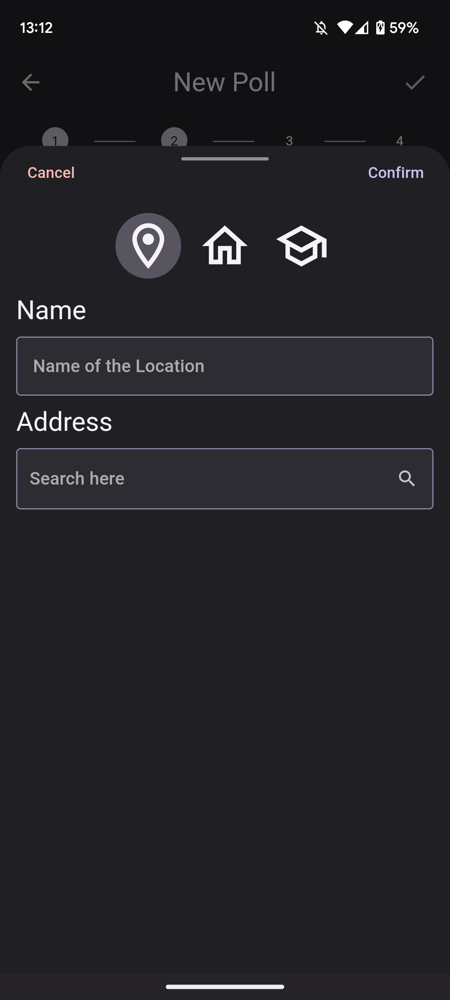

::: titlepage
::: center

<h3>
Alessio Hu

Gabriele Lazzarelli

Spring 2023
</h3>

 

# Introduction

## Purpose of the Document

The purpose of this document is to provide a detailed documentation for
the Eventy mobile application. It includes the functional and
non-functional requirements, design considerations, and technical
specifications for the application.

## Scope of the Application

Eventy is a mobile application designed to simplify the process of
organizing events for groups or organizations. The application provides
an easy way to coordinate the preferences of all members and streamline
the communication of event details. With Eventy, users can create polls
with multiple choices for time and location, invite users to participate
in events.

## Overview of the Application

Eventy offers a range of features and functionalities to simplify event
organization and coordination. Users can create polls for time and
location, invite users to events, search for events based on name, and
get notifications of new events. Users can view their upcoming events
and polls they created or to which they have been invited in their
profile. The application does not include a chat feature, and it is
assumed that the poll creator will provide all possible availabilities
and intends to be present at the event.

# User Requirements

## User Personas

Eventy is designed to cater to a wide range of users who are interested
in organizing events in a hassle-free manner. The primary users of
Eventy are individuals, groups, and organizations who need to coordinate
the organization and creation of events. These users may include event
organizers, party planners, business owners, and social groups.

Currently, these users may rely on traditional communication methods
such as phone calls, text messages, or emails to organize events.
However, these methods can be time-consuming and often result in
miscommunication or confusion. Moreover, it can be difficult to gather
all the prefereces about time and place from all the members of the
group when there are many options to choose from.

## User Stories

To understand the needs and requirements of the users, we have
identified the following user stories for Eventy:

-   As an event organizer, I want to be able to create a poll for time
    and location so that all members can vote and we can select the most
    convenient option.

-   As a poll participant, I want to receive notifications of new events
    so that I can stay up-to-date and not miss any important events.

-   As a user, I want to be able to create a group of user for events, I
    can add users based on their usernames so that I can easily create
    events and invite a specific group of people each time.

## Use Cases

The key use cases for the Eventy application include:

-   Creating a poll for time and location: users can create a poll with
    a set of possible choices for time and location. Members of the
    group can vote on their preferred options.

-   Inviting users to events: users can invite members of the group to
    participate in events. Invitations can be seen through the
    application, and users can accept or decline the invitation. If push
    notifications are enabled, users will also receive notifications of
    new events.

-   Creating groups: users can create groups of users for events. They
    can add users to the group based on their usernames.

-   Getting notifications of new events: users can receive notifications
    of new events. If push notifications are enabled, users will receive
    notifications of new events.

## Use Case Scenarios

An example scenario in which a user would use the Eventy application is
as follows:

\"Samantha is a busy professional who wants to organize a birthday party
for her friend but hasn't much time at hand. She creates a poll for time
and location using the Eventy application and sends invitations to her
friends. They all vote on their preferred options, and Samantha selects
the final option after the deadline. She creates a private event for the
selected date and location, and only invited members can view the event
details. Samantha and her friends can communicate and coordinate the
party details through the Eventy application, making the process of
organizing the event much easier and efficient.\"

# Architecture and System Design

## Technical Overview

Eventy is developed using the Flutter framework. Flutter is an
open-source mobile application development framework that allows
developers to build high-performance, cross-platform mobile applications
for iOS and Android with a single codebase.

Firebase is used as the backend for Eventy. Firebase provides several
features and services that we used in our application, such as
authentication, real-time database, cloud storage, and push
notifications. We chose Firebase because it is easy to integrate with
Flutter and provides a scalable, reliable backend infrastructure for our
application.

## Hardware and Software Requirements

Eventy is designed to run on a wide range of devices, with a focus for
smartphones and tablets. The minimum hardware and software requirements
for running the application are as follows:

-   **Android:** Android 6.0 (Marshmallow) or higher, with at least 2 GB
    of RAM and a quad-core processor

-   **iOS**: iOS 12.0 or higher, with at least 2 GB of RAM and an A9 or
    newer processor

-   **Mac**: macOS 10.13 or higher, with at least 4 GB of RAM and a
    dual-core processor

-   **Windows**: Windows 7 or higher, with at least 4 GB of RAM and a
    dual-core processor

The application requires an active internet connection to function
properly.

## System Architecture

Eventy follows a client-server architecture, where the mobile app acts
as the client, and the Firebase backend acts as the server. The client
communicates with the server through REST APIs provided by Firebase. The
client also communicates with a node server to send push notifications
to the users.

    

    In blue we a have db query from the app, in green the handling of notifications.

The system architecture of a Flutter app with Firebase as a backend can
be described in three main layers: UI layer, business logic layer, and
service layer. This architecture aims to reduce developer time, provide
a common structure, and clearly define the app layers.

#### UI Layer

This layer consists of Flutter widgets, which are the fundamental
building blocks of Flutter user interfaces. Flutter allows for reactive
user interfaces, meaning that the UI can automatically update as the
underlying data changes.

#### Business Logic Layer

This layer contains all app business and presentation logic. When using
Firebase, you'll need to install the required dependencies. For example,
you may need the firebase_auth and cloud_firestore packages to enable
Firebase authentication and Cloud Firestore.

#### Service Layer

This layer contains services needed to interact with third-party
services such as APIs. For Firebase, this involves integrating the
Firebase SDK into your Flutter app, depending on the platform you're
targeting (Android, iOS, or web). For Android, for example, you'll need
to add specific dependencies to your app-level build.gradle file and
configure the Firebase Core plugin.

## External Services

We use the following external services in our application:

-   **Open Street Map API:** used to show the location of the event on
    the map

-   **Firebase:** used as the backend for the application

-   **Node.js:** used to send push notifications to the users

-   **Nominatim:**[^1] used to search for locations and retrieve
    location data

## Database Design

Eventy uses Firestore Database to store all the data. The database
schema is designed to reflect the requirements of the application.

We have the following collections in the Firebase database:

-   The **group** collection stores all the groups created by the users.
    Each group has a unique group id, which is used to identify the
    group. The group id is generated by Firebase when a new group is
    created. A group is used to identify a subset of user in the
    database.

    

-   The **notification** collection stores all the notifications sent to
    the users. Each notification has a unique notification id, which is
    used to identify the notification. The notification id is generated
    by Firebase when a new notification is created. A notifications can
    be made of by one or more notification events.

    

-   The **poll_event** collection stores all the poll events created by
    the users. Each poll event has a unique poll event id, which is used
    to identify the poll event. The poll event id is generated by
    Firebase when a new poll event is created. A poll event is used to
    identify a subset of user in the database.

    

-   The **poll_event_invite** collection stores all the poll event invites sent to the users. Each poll event invite has a unique poll
    event invite id, which is used to identify the poll event invite.
    Invites for the same poll event sent to different users will have
    the same poll event invite id e.g., \"event0ofUser0\". A poll event
    invite is a pair of poll event id and invitee id, which is used to
    associate a user to the event which he is invited.

    

-   The **user** collection stores all the users registered in the
    application. Each user has a unique user id, which is used to
    identify the user. The user id is generated by Firebase when a new
    user is created. A user have a username attribute and a
    username_lower attribute, which is used to identify the user in the
    database. The username_lower attribute is used to perform case
    insensitive search in the database, e.g., when searching for a user
    by username to add to a group.

    

-   The **vote_date** collection stores all the votes for the dates of
    each poll event. Each vote has a unique vote id, which is used to
    identify the vote, and each can have four different integer values
    to express the user's preference for the date.

    

-   The **vote_location** collection stores all the votes for the
    locations of each poll event. Each vote has a unique vote id, which
    is used to identify the vote, and each can have four different
    integer values to express the user's preference for the location.

    

    For both vote_date and vote_location the votes can assume the
    following values:

    -   -1: the user has not expressed any preference

    -   0: the user is not available

    -   1: the user is available but prefers another date/location

    -   2: the user is available but prefers this date/location

# User Interface Design

## Design Overview

Eventy's user interface is designed to be intuitive and easy to use,
with a modern and clean design language that emphasizes simplicity and
clarity. The application's UI is designed to be consistent across
different platforms, with a responsive layout that adapts to different
screen sizes and resolutions.

## Navigation flow

The navigation flow of the application is designed to be simple and
intuitive. The user can navigate between different screens using a
bottom navigation bar, which is visible on all screens. The navigation
bar consists of icons representing the main features of the application:

-   Home

-   Groups

-   Create Event

-   Notifications

-   Settings

The **navigation flow** on first launch is as follows:

-   The user is presented with a login screen, where they can enter
    their username and password or sign up for a new account.

-   After logging in or signing up, the user is presented with the home
    screen, which displays a list of upcoming events. From that point,
    the user can navigate to any of the other screens using the bottom
    navigation bar:

    -   The user can then navigate to the groups screen, where they can
        view a list of their groups and create new groups.

    -   The user can then navigate to the create event screen, where
        they can create a new event.

    -   The user can then navigate to the notifications screen, where
        they can view a list of their notifications.

    -   The user can then navigate to the settings screen, where they
        can view and edit their profile information and the application
        settings.

    

    Navigation flow diagram

## Screen layouts

The application consists of five primary screens, each designed to
address a specific need:

-   Home

-   Groups

-   Create Event

-   Notifications

-   Settings

They can be accessed from the bottom navigation bar. The other screens
are accessed from the main screens, and they are designed to provide
additional functionality.

#### Home Screen

This is the first screen that the user sees when they open the
application. It displays a list of the upcoming events, which are
filtered in two tabs, one for the event created by the user and one for the events the user is invited to. The user can tap on an event to view its details.

|||
|:-:|:-:|
|Events created by the user|Events the user is invited to|

    

    Tablet home in light mode

#### Groups

This screen displays a list of the user's groups. The user can tap on a group to view its members.

||||
|:-:|:-:|:-:|
|Groups screen|Group detail|Create new group|

#### Create Poll

This screen allows the user to create a new poll. The user can enter a
title and add options for the poll. The user can also add a description
and set a deadline for the poll. The user can then share the poll with
other users or groups by inviting them to the poll.

||||
|:-:|:-:|:-:|
|Set title - create screen|Locations or virtual event|Add locations|

||||
|:-:|:-:|:-:|
|Add dates|Invite group members|Invite user|

#### Notifications

This screen displays a list of the user's notifications. The user can tap on a notification to view its details. Notifications about events, if cliked, will redirect the user to the event details screen.

|||
|:-:|:-:|
|Notifications|Event details|

    

    Tablet event detail in light mode

#### Settings

This screen displays the application settings. The user can edit their profile information and password. The user can also decide to log out from the application.

||||
|:-:|:-:|:-:|
|Settings|Edit profile|Change password|

## Visual design elements

The visual design of the application is based on a modern and minimalist
design language, with a focus on simplicity and ease of use. The
application uses a consistent color scheme throughout, with a light and
a dark theme. The color and basic shapes are Material Design 3
compliant, thanks to the use of the FlexColorScheme package[^2].

|||
|:-:|:-:|
|Dark theme|Light theme|

# Features and Functionality

## Feature List

-   User profile with name, username, and profile picture

-   Poll creation with date and location options

-   Ability to invite users to an event

-   Home page with upcoming events and polls

-   Storage of user data and preferences

-   Updates of event and poll statuses through push notifications

## Functional Requirements

The following functional requirements must be met in order for Eventy to
perform as expected:

-   Users can create polls for events with date and location options.

-   Users can invite other users to events and polls.

-   Users can create private events that are only visible to invited
    users.

-   Users can view their home page with upcoming events and polls.

-   Users can authenticate and authorize with their account.

-   User data are securely stored in a database.

-   User app preferences are stored locally on the device.

-   Users receive notifications of event and poll statuses.

## Non-functional Requirements

The following non-functional requirements must be met in order for
Eventy to perform as expected:

-   The application must be responsive and fast.

-   The application must be available 24/7 with minimal downtime for
    maintenance.

-   The application must be secure and protect user data and
    preferences.

-   The application must be easy to use and intuitive for users of all
    technical abilities.

# Testing

## Testing Methodology

The testing methodology for Eventy will be a combination of manual and
automated testing. Manual testing will be performed by the development
team. Automated testing will run through the flutter `test` command.

## Test Plan

The test plan for Eventy includes a comprehensive set of test cases that
will be executed throughout the development process. The goal is to
ensure that the application functions as expected and meets the user
requirements. In particular we will test different aspects of the
application: unit, widget and integration tests.

### Unit tests

Unit tests are run to verify the correctness of a single function,
method, or class under a variety of conditions. The main goal of a unit
test is to ensure that a specific \"unit\" of logic in your codebase
works as expected.

### Widget tests

The goal of a widget test is to verify that the widget's UI looks and
interacts as expected. This involves testing multiple classes and
requires a test environment that provides the appropriate widget
lifecycle context.

### Integration tests

Integration tests are run to test a complete app or a large part of an
app. The goal of an integration test is to verify that all the widgets
and services being tested work together as expected. Here we show the
most significant tests with the corresponding sequence diagrams

-   **Sign Up** This test case verifies that the user can sign up to the
    application.

    

-   **Log In** This test case verifies that the user can log in to the
    application using the correct credentials.

    
-   **Create Poll** This test case verifies that the user can create a
    poll.

    

-   **Vote Poll** This test case verifies that the user can vote a poll.

    

-   **Create Group** This test case verifies that the user can create a group.

    

Through the flutter coverage library, we managed to achieve a test
coverage of 80%. The untested lines were manually tested and consist of
mostly fallback widgets and methods in case of server errors (e.g.
Firebase excpetions) or internet connection errors.

    

    Testing coverage

### Automation testing

Automation testing is the process of testing software and other tech
products to ensure it meets strict requirements. In our case, this will
be performed through GitHub CI/CD and GitHub actions. We will work on
different branches, mainly:

-   For each functionality and main screen we will do a dedicated branch

-   Each time a feature has been completed, relative tests will be
    written (the ones mentioned before) and tested first manually in
    local, then automatically through GitHub actions once they have been
    pushed on the repository

-   If the tests are successful, we will open a pull request and merge
    the changes onto the main branch

The automatic pipeline will also check if the code is correctly
formatted and if there are no warnings according to Very Good Analysis'
definition.

# Conclusion

## Summary of the Design Document

In this design document, we have presented the technical details of
Eventy, an application designed to help users easily organize events and
coordinate with others. We have covered the user requirements, system
architecture, user interface design, and testing and quality assurance
processes, among other important aspects of the application's
development.

## Next Steps and Future Enhancements

Moving forward, we plan to continue refining and improving Eventy based
on user feedback and usage patterns. Specifically, we will be focusing
on improving the app's performance and scalability, enhancing the user
interface and user experience, and adding new features and capabilities.

Some potential future enhancements include adding support for in-app
messaging and chat functionality, incorporating location-based
recommendations and search capabilities, and leveraging machine learning
and predictive analytics to help users better plan and organize events.

Overall, we are excited about the potential of Eventy to help users more
easily plan and coordinate events.

[^1]: The documentation of Nominatim service is available at
    <https://nominatim.org>

[^2]: The FlexColorScheme package documentation is available at
    <https://docs.flexcolorscheme.com/>
